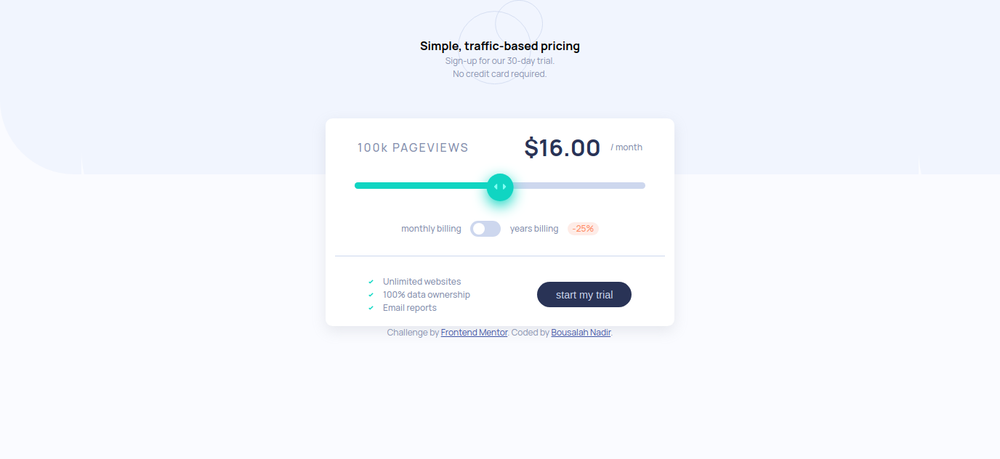
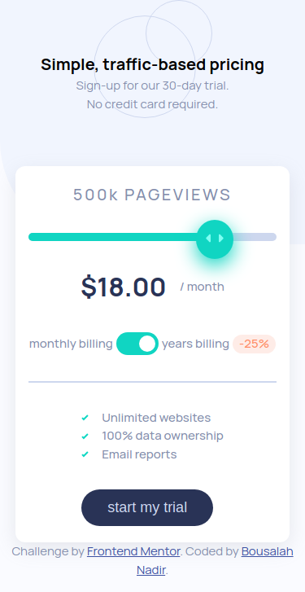

# Frontend Mentor - Interactive pricing component solution

This is a solution to the [Interactive pricing component challenge on Frontend Mentor](https://www.frontendmentor.io/challenges/interactive-pricing-component-t0m8PIyY8).

## Table of contents

- [Overview](#overview)
  - [The challenge](#the-challenge)
  - [Links](#links)
  - [Screenshot](#screenshot)
- [My process](#my-process)
  - [Built with](#built-with)
- [Author](#author)

## Overview

### The challenge

Users should be able to:

- View the optimal layout for the app depending on their device's screen size
- See hover states for all interactive elements on the page
- Use the slider and toggle to see prices for different page view numbers

### Links
- Solution URL: [Solution](https://github.com/Medido1/Frontend-Mentor-Interactive-pricing-component)
- Live Site URL: [Live Site](https://medido1.github.io/Frontend-Mentor-Interactive-pricing-component)

### Screenshot
  # Desktop
  
  # Mobile
  
## My process

### Built with
- Semantic HTML5 markup
- CSS custom properties
- Flexbox
- Mobile-first workflow

## Author

- Frontend Mentor - [@Medido1](https://www.frontendmentor.io/profile/Medido1)
- Github - [@Medido1](https://github.com/Medido1)
- Contact Me: bousalah.moh@gmail.com
